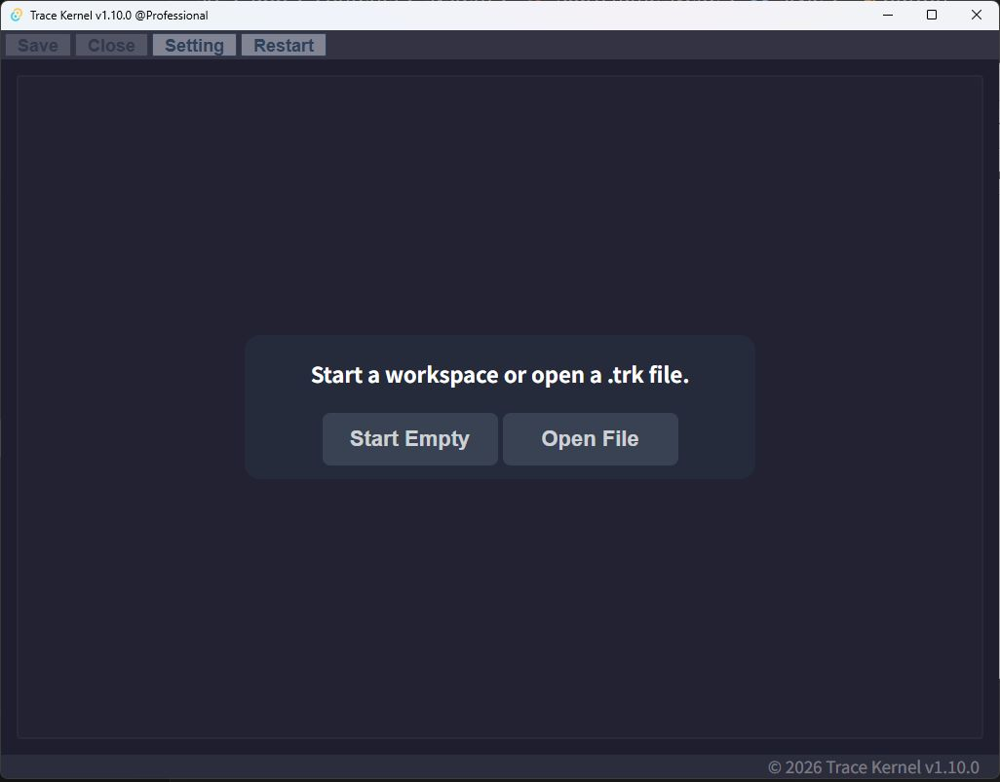

# アプリ概要

## アプリ名

**Trace Kernel**

## 実現できること

TypeScriptのプログラムで、**書く・実行する・結果を表示する**を、1つのアプリ上で完結させます。

従来必要だった以下の作業は、**一切不要**です。

| 従来の作業 | Trace Kernelでは |
|-----------|----------------|
| 環境構築 | 不要 |
| プロジェクト作成（物理ファイル生成） | 不要 |
| コンパイル・トランスパイル | 不要 |
| ターミナルでの実行 | 不要 |
| 依存関係のインストール（npm） | 不要 |
| ファイル読み込みのためのコード | 不要 |

## リソースの自動注入

プログラムで使うリソースをGUI上で管理し、プログラムに自動注入することができます。  
リソースを読み込むためのボイラープレートコードは不要です。

### 設定例

| 項目 | 設定値 |
|------|--------|
| 変数名 | `userList` |
| 値 | 1000行のCSVテキスト |
| パース設定 | CSV to JSON |

この設定により、プログラム内で以下のように参照できます。

```typescript
// $resource.userList で型付きオブジェクト配列として参照可能
$resource.userList.forEach(user => {
  console.log(user.id); // CSVのヘッダ名がプロパティになる
});
```

## エディタの補完

プログラムエディタには **Monaco Editor** を採用しています。  
GUIで設定したリソースをもとに、補完情報が動的に注入されます。

```typescript
// 補完が効く例
$resource.userList[0].id  // CSVのカラム名が補完される
$env.DEST_DIR              // envで定義した変数名が補完される
```

## 画面構成

Trace Kernelは以下の4つの画面で構成されます。



| 画面 | 説明 |
|------|------|
| スタート画面 | 新規開始 or 既存ファイルから開始を選択 |
| ワークスペース管理画面 | コンテキスト要素の管理とwork（プログラム）の作成 |
| プログラムエディタ | TypeScriptの記述・実行・結果確認 |
| トランザクションダイアログ | ファイルシステム変更の確認・コミット |

## ワークスペースの保存

ワークスペースは `.trk` 形式のファイルとして保存できます。

- 形式：ワークスペースのJSONをgZip圧縮したプレーンテキスト
- 保存：`Ctrl+S` またはヘッダのSaveボタン
- 新規（未保存時）：ファイル保存ダイアログを表示、ヘッダに `(Untitled)*` と表示
- 既存ファイル読み込み後 or 一度保存済み：上書き保存
