# ワークスペース管理

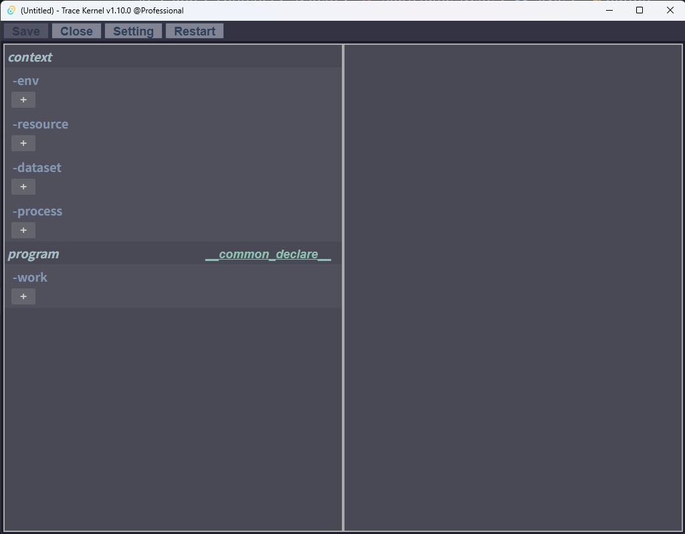

## 画面構成

ワークスペース管理画面は以下の3エリアで構成されます。

- **メニューヘッダー**：保存（Save）などの全体操作
- **コンテキストツリー（左半分）**：各要素の一覧と追加
- **詳細編集エリア（右半分）**：ツリーで選択した要素の詳細編集画面

### ワークスペースの保存とファイル形式（.trk）

*   ヘッダーの「Save」ボタン、または `Ctrl + S` キーでワークスペース全体を保存できます。
*   保存されるファイルの拡張子は **`.trk`** （中身はJSONのgzip圧縮テキスト）です。
*   新規作成直後はヘッダーが `(Untitled)*` となり、初回保存時に保存ダイアログが開きます。一度保存した（または既存ファイルを読み込んだ）後は**上書き保存**になります。

## ワークスペースの要素

ワークスペースで管理する要素は5種類あります。

```
ワークスペース
├── context（コンテキスト情報）
│   ├── env      - 環境変数
│   ├── resource - 静的リソース
│   ├── dataset  - 動的リソース（ファイル参照）
│   └── process  - 外部プログラム呼び出し
└── program（プログラム）
    └── work     - TypeScriptを書いて実行する単位
```

`work` を除く4要素（env / resource / dataset / process）は、  
workのプログラム内で参照できる**コンテキスト情報**です。

## 要素の共通仕様

### 追加・編集
- 各要素のツリーの `+` ボタンで要素を追加
- 追加した要素をクリックすると、右の詳細エリアに編集画面が表示される
  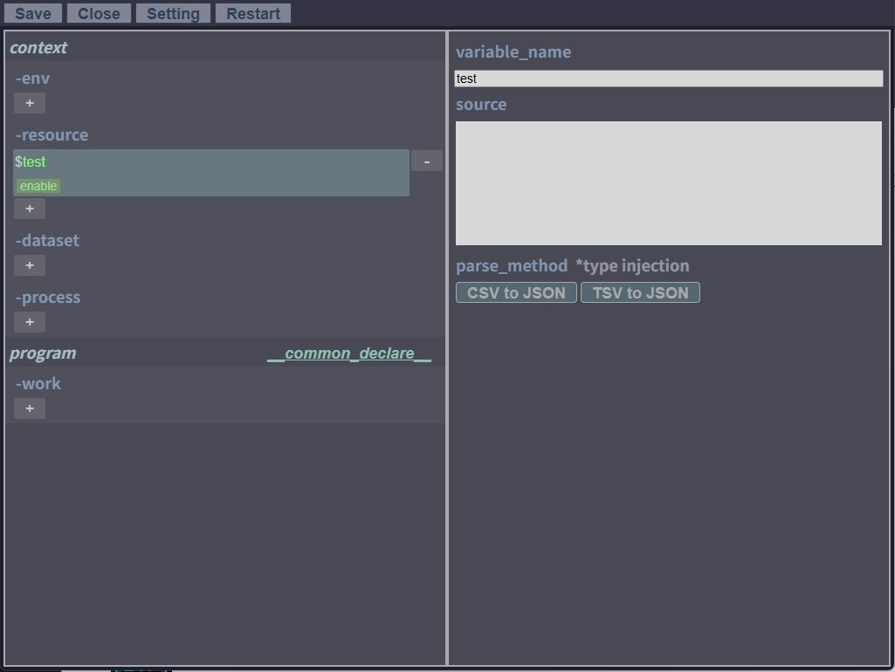
- 編集は**即時反映**（保存・キャンセルの概念なし）

### 状態管理（enable / error）
各要素は常に `enable` または `error` の状態を持ちます。

| 状態 | 色 | 条件 |
|------|----|------|
| enable | 緑 | 必要な情報がすべて正常に入力されている |
| error | 赤 | 必須項目が未入力 or 入力内容に不整合がある |

- 名前（変数名）が同じ要素が複数存在する場合、**重複した両方がerrorになる**
- `error` 状態の要素はworkのプログラムから参照できない（存在しないものとして扱われる）

### コンテキストの参照

ワークスペースで定義されたコンテキスト要素は、workのプログラム内で以下のように参照できます。

```typescript
$env.DEST_DIR          // envで定義した変数名
$resource.userData     // resourceで定義した変数名
$resource.setting
$dataset.workspace     // datasetで定義した変数名
$process.myTool()      // processで定義した関数名
```

---

## コンテキスト要素「env」

### 概要
変数名と値のペアを登録し、環境変数として利用するためのシンプルな要素です。  
プログラムに値を直書きせず、外部から管理できます。

### 設定項目

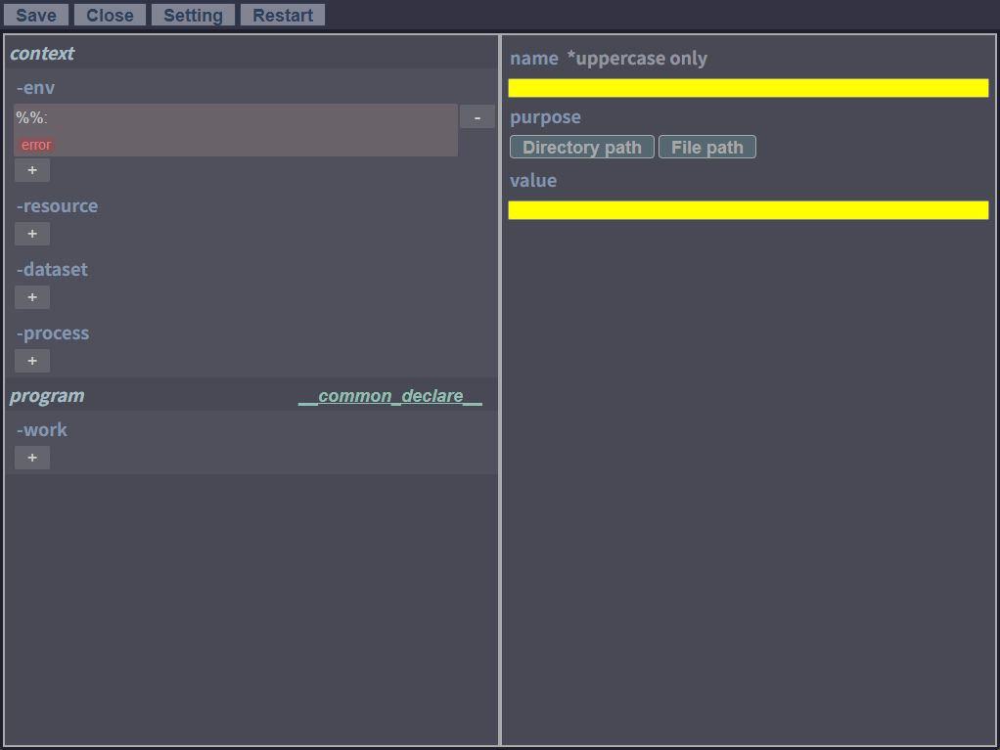

| 項目 | 説明 |
|------|------|
| `name` | 変数名（**大文字のみ許容**） |
| `value` | 値 |
| `purpose` | 用途のドロップダウン。未指定の他、**`Directory path`** または **`File path`** を選択可能。選択すると値として入力したパスの妥当性をリアルタイムでチェックします。 |

> `purpose` のチェックはあくまで補助的なUIフィードバック用であり、パスが不正（「指定したパスが存在しない」だけでなく、「ファイルパスを指定したのにディレクトリだった」等の種別不一致も含む）であっても、`env` 要素自体がエラー（赤色）になることはありません。

### コード例

```typescript
// ファイル出力先をenvで管理する例
tx.saveFile(`${$env.DEST_DIR}\\${fileName}`, content);
```

### 他コンテキストからの参照

他のコンテキスト要素でパスを設定する際、`%`ブレースフォルダで囲うことでenvの変数を参照できます。

```
%WORKSPACE%\testApp\src\
```

---

## コンテキスト要素「resource」

### 概要
静的なリソース（ログ・CSV・TSVなどのテキスト）を変数に紐づけるための要素です。  
GUIのテキストエリアに直接貼り付けて管理します。

### 設定項目

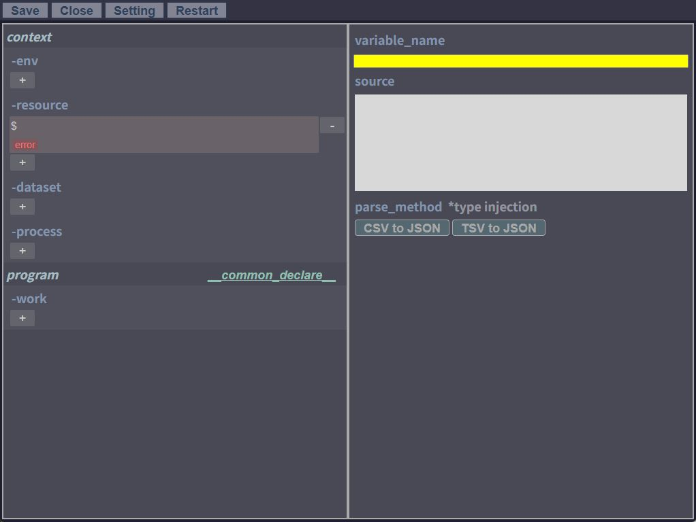

| 項目 | 説明 |
|------|------|
| `variable_name` | 変数名 |
| `source` | ソーステキスト（複数行、ログ・CSV等を直接貼り付け） |
| `parse_method` | ソースの変換方法 |

### parse_method

| 選択肢 | 動作 |
|--------|------|
| （未指定） | `string` 型のテキストとしてそのまま注入 |
| `CSV to JSON` | CSVのヘッダを解析し、型付きオブジェクト配列に変換 |
| `TSV to JSON` | TSVのヘッダを解析し、オブジェクト配列に変換（全カラムstring型） |

> **CSV to JSONの型推論**：全レコードの値がNULLでなくダブルクォーテーションで囲われていない場合、数値変換が可能であれば `number` 型に変換される。

### コード例

```typescript
// parse_method未指定（string型）
const text: string = $resource.rawLog;

// CSV to JSON指定時（型付きオブジェクト配列）
$resource.userData.forEach(user => {
  user.name  // ヘッダ名がプロパティとして補完される
  user.id
});
```

---

## コンテキスト要素「dataset」

### 概要
PC内のファイルを相対パスの集合として管理し、プログラムから遅延ロードするための要素です。  
大量ファイルの処理に適しています。

**主な用途：**
- 大量ファイルのリネーム
- 大量ログの解析
- プロジェクト内のアンチパターン検出

### 設定項目

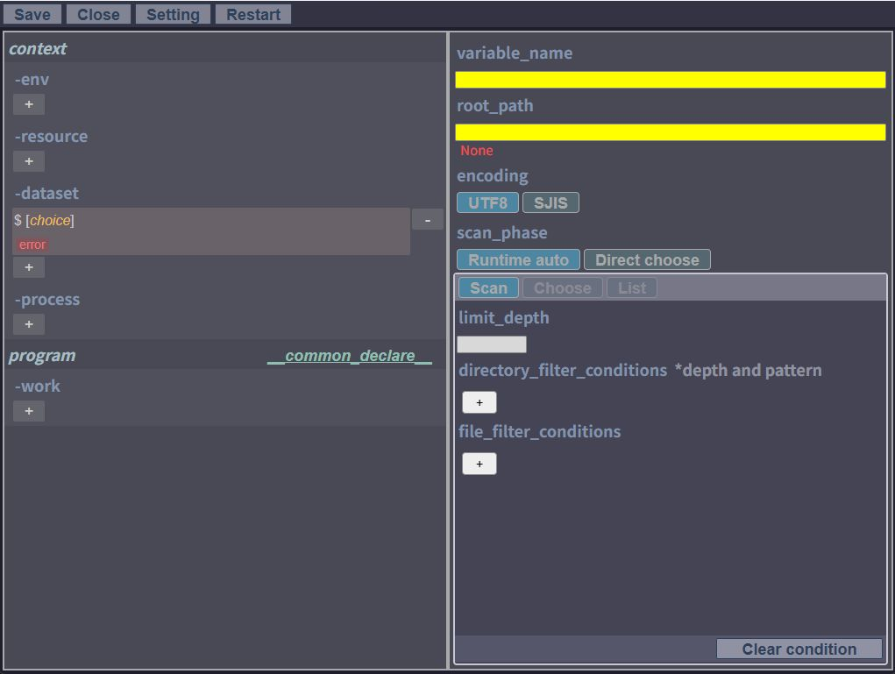

| 項目 | 説明 |
|------|------|
| `variable_name` | 変数名 |
| `root_path` | ルートパス |
| `encoding` | ファイルを開く際のエンコード（`utf8` or `sjis`） |
| `scan_phase` | ファイルをスキャンするタイミング |

### scan_phase

| 選択肢 | 説明 |
|--------|------|
| `Runtime auto` | プログラム実行時に自動でルート配下をスキャン。フォルダの最新状態が毎回反映される。 |
| `Direct choose` | GUI上で事前にファイルを手動選択（Scanボタンでスキャン → ツリーで選択 → Transfer確定）。実行時の前処理なし。 |

### フィルター条件

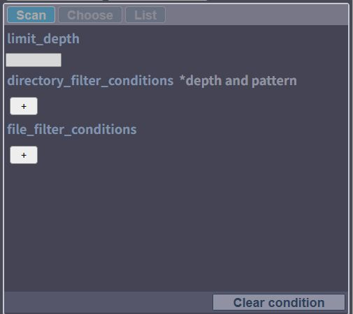

スキャン対象をフィルタリングする条件を設定できます。各条件は `+` ボタンで複数追加できます。

| 条件項目 | 説明 |
|------|------|
| `limit_depth` | スキャンする最大階層数（無指定可） |
| `directory_filter_conditions` | ディレクトリの抽出条件（階層指定およびワイルドカード可） |
| `file_filter_conditions` | ファイルの抽出条件（階層指定なし・全階層対象、ワイルドカード可） |

#### フィルターのUI操作

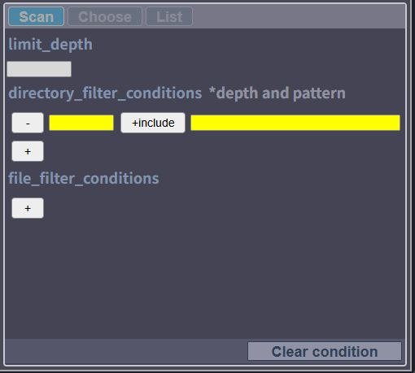
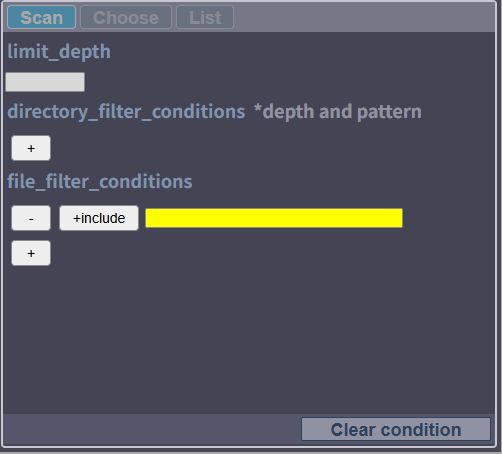

*   **削除**: 左端の `-` ボタンでその条件を削除できます。
*   **階層指定（ディレクトリのみ）**: `-` ボタンの右隣の入力欄で、条件を適用する階層の深さを指定します。
*   **包含/除外トグル**: `+include` ボタンをクリックすると `-exclude` に切り替わります。`exclude` に設定したディレクトリやファイルは「除外対象」となり走査されません。
*   **条件文字列**: 一番右の入力欄に絞り込みの文字列（ワイルドカード指定可）を入力します。

#### フィルター設定例

```
ディレクトリ条件
  1階層目：「.git」を除外
  1階層目：「entity*」を除外
  2階層目：「src」のみ対象

ファイル条件
  「*Impl.java」を対象
  「*Abstract*」を除外
```

→ `.git` と `entity*` を除く1階層目を走査し、2階層目は `src` のみ。  
　以降の階層は全て走査。`*Impl.java` を対象にするが `*Abstract*` は除外。

### Direct choose の操作フロー

1. 「Scan」ボタンを押下 → ルート配下を走査しツリー表示
   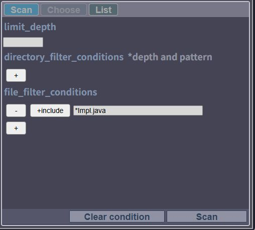
   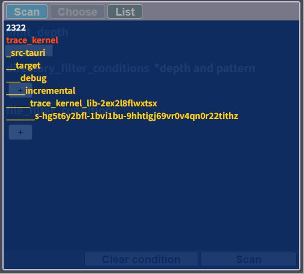
   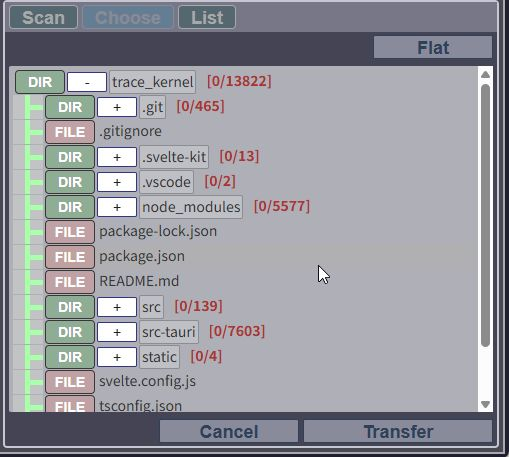
2. `FILE` をクリック → 個別ファイルを選択状態に
3. `DIR` をクリック → ディレクトリ配下の全ファイルを選択状態に
   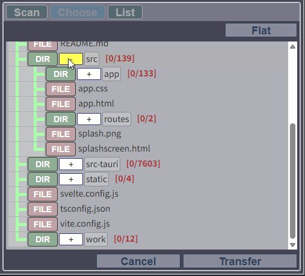
   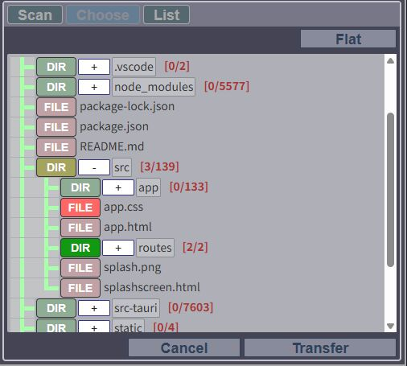
4. 画面右上の「Flat」ボタンで、選択中のファイルを一覧表示（フラット表示）に切り替えることも可能（「Tree」表示とトグルでいつでも切り替え可能）
   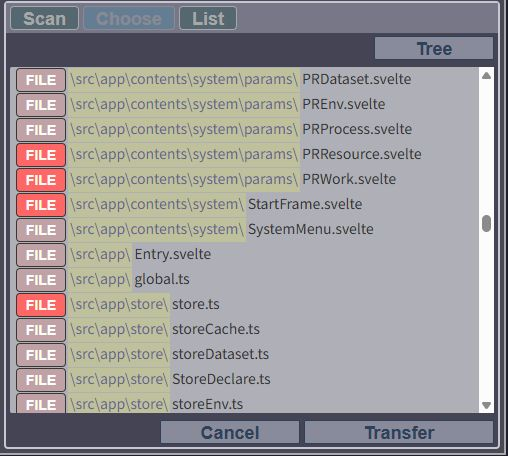
5. 「Transfer」ボタンで選択したファイルを確定
   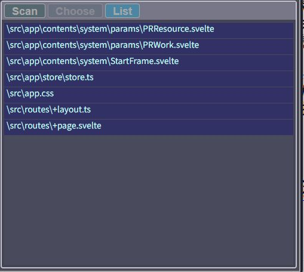

### コード例

```typescript
for (const d of $dataset.workspace) {
  d.fileName      // ファイル名のみ
  d.absolutePath  // フルパス
  d.relativePath  // ルートからの相対パス
  await d.content() // ファイルの中身を非同期で取得
}
```

### scan_phase の使い分け

| ユースケース | 推奨 |
|-------------|------|
| フォルダにファイルを入れる都度、最新状態を反映したい | `Runtime auto` |
| 解析対象が固定で、実行速度を重視したい | `Direct choose` |

---

## コンテキスト要素「process」

### 概要
外部プログラム（.exe など）をTrace Kernelのスクリプトから**関数として呼び出す**ための橋渡し機能です。

### 設定項目

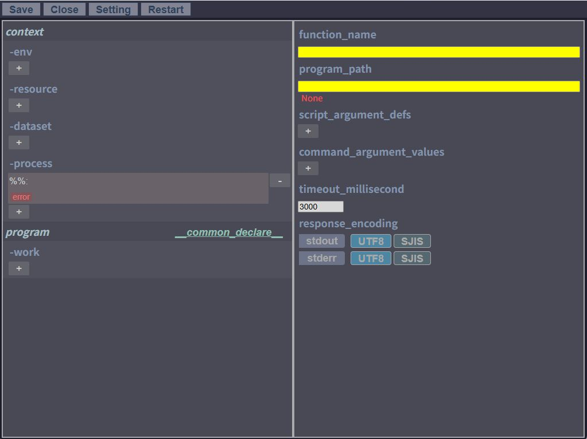

| 項目 | 説明 |
|------|------|
| `function_name` | スクリプトで呼び出す関数名 |
| `program_path` | 実行するプログラムのフルパス |
| `script_argument_defs` | スクリプト引数の定義（後述のUI操作あり） |
| `command_argument_values` | 外部プログラムに対するコマンドライン引数の値 |
| `timeout_millisecond` | タイムアウト時間（ミリ秒）。超過でランタイムエラー |
| `response_encoding` | stdout / stderr それぞれの出力のエンコード指定（`utf8`、`sjis` 等から選択） |

#### 引数リストのUI操作

*   **追加と削除**: 項目の見出し横の `+` ボタンで引数を追加し、各行の左端にある `-` ボタンで削除できます。
*   **型指定トグル（スクリプト引数のみ）**: 入力欄の右隣にある「Number」ボタンをONにすると、TypeScript側での引数の型が `number` 型として補完・強制されます（数値以外を渡すとエラーになります）。デフォルト（OFF時）は `string` 型です。

### スクリプト引数とコマンドライン引数の連携

スクリプト引数は `__変数名__` 形式のブレースフォルダで、コマンドライン引数に注入できます。  
コマンドライン引数に注入しない限り、スクリプト引数の定義だけでは実行に反映されません。

### コード例

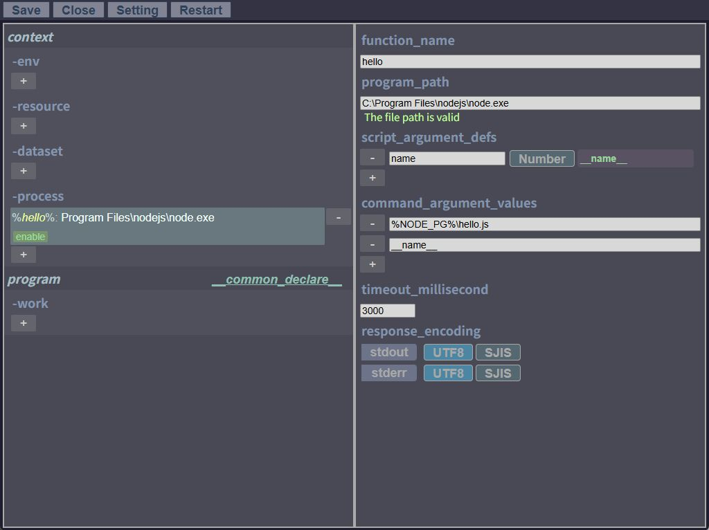

```typescript
// processで "hello" という関数を定義した場合
const { stdout, stderr } = await $process.hello('taro');
$println(stdout); // "taroさんこんにちは"
```

### 実用例

- 複数のJARファイルを解凍する外部ツールをまとめて呼び出し、全classファイルを逆コンパイルして脆弱性ライブラリを検索する
- nodeで実行するJSスクリプトに動的な引数を渡して実行結果を取得する
