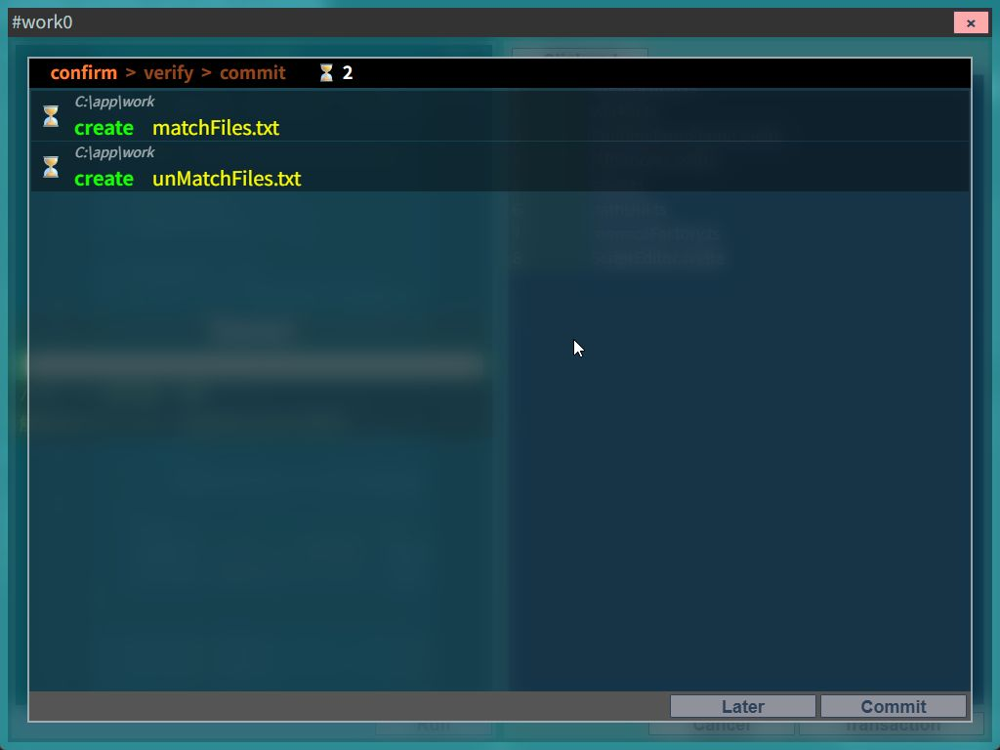
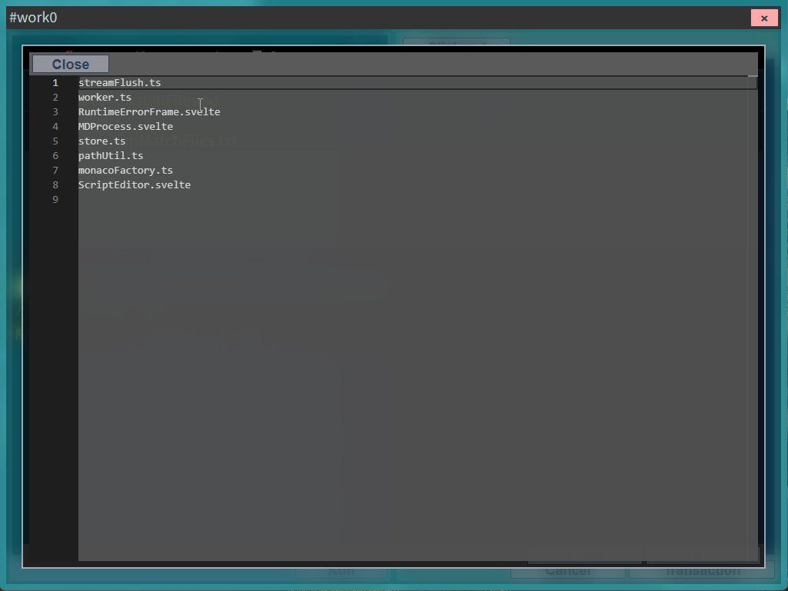
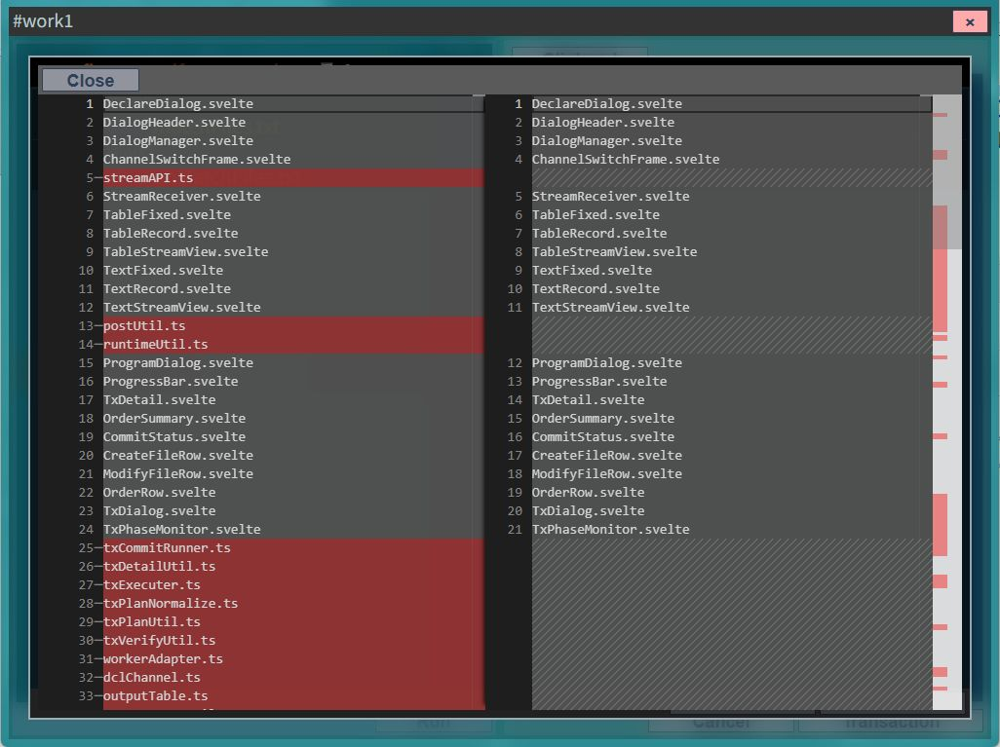
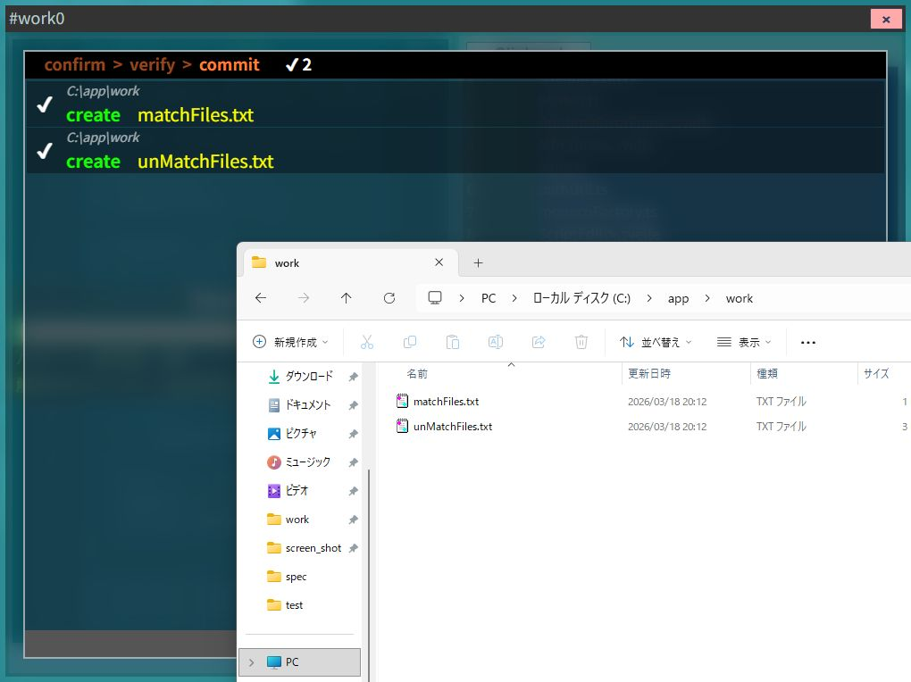

# $fs API リファレンス

`$fs` は、ファイルシステムへの読み書きを行う関数群を提供する独自APIです。

操作方法は2種類あります。

| 方式 | 概要 |
|------|------|
| **直接操作** | 即時に実FSへ読み書きする非同期関数群 |
| **トランザクション操作** | 仮想FS上にオーダーを積み、確認後に一括コミット |

---

## 直接操作 API

全て非同期関数であり、実行時に即座に実FSへ操作が反映されます。メソッドを呼び出す際は `await` が必要です。
また、**パスを引数に取るメソッドは全て「絶対パス」であること**が前提となっており、相対パスを渡すと実行時エラーになります。

### 共通の型定義

```typescript
type FileStat = {
    size: number;
    isFile: boolean;
    isDir: boolean;
    createdAt?: number;
    modifiedAt?: number;
}
```

### メソッド仕様と論理チェック

#### 状態取得・検索

*   **`exists(path: string): Promise<boolean>`**
    指定パスが存在するかチェックします。
*   **`glob(pattern: string): Promise<string[]>`**
    パターン（ワイルドカード等）に一致するパスの配列を取得します。
*   **`stat(path: string): Promise<FileStat>`**
    ファイルのサイズや作成日、ファイル/ディレクトリ判定などの詳細情報を取得します。
*   **`readDir(dir: string): Promise<{ name: string; isDir: boolean; }[]>`**
    ディレクトリ配下の要素（ファイル名とディレクトリフラグ）を一覧で取得します。

#### ファイル読み書き・コピー

*   **`readBinary(filePath: string): Promise<ArrayBuffer>`**
    バイナリデータを読み込みます。
*   **`readText(filePath: string, encoding?: 'utf8' | 'sjis'): Promise<string>`**
    テキストデータを読み込みます（エンコーディング省略時は `utf8`）。
*   **`saveText(filePath: string, content: string): Promise<void>`**
    テキストファイルを作成・上書き保存します。
*   **`copyFile(src: string, dest: string): Promise<void>`**
    指定されたファイルをバイナリコピーします。
    *   **論理チェック:** `src`のパスの対象がディレクトリであった場合は「Source is not a file」というエラーとなります。

#### ディレクトリ・ファイル削除・作成・移行

*   **`makeDir(dirPath: string): Promise<void>`**
    ディレクトリを作成します。
    *   **論理チェック:** 既に同パスが存在する場合、それが「ディレクトリ」であれば何もしません（冪等性が保たれます）。同名パスが「ファイル」として存在していた場合はエラーとなります。
*   **`deleteFile(filePath: string): Promise<void>`**
    ファイルを削除します。
*   **`deleteDir(dirPath: string): Promise<void>`**
    ディレクトリを削除します。
    *   **論理チェック:** 削除対象のディレクトリが「空」である必要があります。
*   **`renameFile(targetFilePath: string, newFileName: string): Promise<void>`**
    ファイルの名前を変更します。
    *   **論理チェック:**
        *   `newFileName` にパス区切り文字（`/` や `\`）が含まれているとエラーになります。（ディレクトリ階層の移動不可）
        *   リネーム対象のファイルが存在しない場合はエラーになります。
        *   リネーム対象のパスがディレクトリであった場合（`isFile` ではない場合）はエラーになります。
        *   Windows独自の大文字・小文字違いディレクトリなどで内部的な親ディレクトリの乖離が起きた場合、クロスディレクトリのリネーム制限に引っかかります。
        *   変更後の新しい同名ファイルが既に存在している場合はエラーとなります。
*   **`renameDir(targetDirPath: string, newDirName: string): Promise<void>`**
    ディレクトリの名前を変更します。論理チェックは `renameFile` と同等で、対象がディレクトリであるかどうかが検証されます。

### `useTransaction()` の仕様について

*   **`useTransaction(): TransactionAPI`**
    安全なファイル操作を提供する仮想FSのトランザクションを開始し、APIハンドルを取得します。
    *   **論理チェック:** 1つのワーク（ワーカーのセッション実行）につき **1回のみ** 呼び出し可能です。同一プログラム内で2回以上呼び出すと実行時エラーとなります。

### コード例

```typescript
// テキストファイルの読み込み
const content = await $fs.readText(`${$env.ROOT}\\file.txt`, 'utf8');

// ファイルの存在チェック
const exists = await $fs.exists(`${$env.OUTPUT}\\result.csv`);

// ディレクトリ内の一覧取得
const entries = await $fs.readDir($env.SRC_DIR);
for (const entry of entries) {
  $println(`${entry.name} (${entry.isDir ? 'DIR' : 'FILE'})`);
}
```

---

## トランザクション操作 API

### 概要

トランザクションAPIは、直接FSに書き込む代わりに**仮想FS上に書き込みオーダーを積み**、  
スクリプト実行終了後に表示される**トランザクションダイアログで確認・コミット**する仕組みです。

- 書き込み系の操作は**同期処理**で書ける（`await` 不要）
- 読み込み（`openText`）は非同期（`await` 必要）

### useTransaction

```typescript
const tx = $fs.useTransaction();
```

`useTransaction()` はトランザクションの開始ではなく、**トランザクション利用の宣言**です。  
この呼び出しにより、仮想FSへ書き込むためのハンドル（API群）を取得します。

### トランザクション関数仕様と論理チェック

| 関数 | シグネチャ | 説明 |
|------|-----------|------|
| `makeDir` | `(dirPath: string) => void` | ディレクトリ作成を予約する |
| `openText` | `(filePath: string, encoding?: "utf8" \| "sjis") => Promise<{ token: FileToken; content: string; }>` | テキストを読み込み、**チェックアウト状態**にする。以降はトークン経由でのみ変更操作可能。 |
| `updateText` | `(token: FileToken, content: string) => void` | テキストを更新するオーダーを積む。`openText` とペアで使用。 |
| `saveText` | `(filePath: string, content: string) => void` | 新規テキストファイルを作成するオーダーを積む |
| `copyFile` / `copyFileByToken` | `(from: string, dest: string) => void`<br>`(token: FileToken, dest: string) => void` | ファイルコピーのオーダーを積む |
| `deleteFile` / `deleteFileByToken` | `(filePath: string) => void`<br>`(token: FileToken) => void` | ファイル削除のオーダーを積む |
| `renameFile` / `renameFileByToken` | `(targetFilePath: string, newFileName: string) => void`<br>`(token: FileToken, newName: string) => void` | ファイル名変更のオーダーを積む |

> 各メソッドは呼び出し時点で**VFS上での論理検証**が行われます。不正な操作や競合・矛盾（例えば削除済みファイルの上書きなど）が見つかった場合は即時にエラーがスローされます。

#### 📁 ディレクトリ操作

*   **`makeDir(dirPath: string): void`**
    *   **VFS検証:** 既に同トランザクション内で該当ディレクトリを削除予約している場合はエラー。指定したパス、およびその親パスが既にファイルとして作成・予約されている場合もエラー。一度作成予約したパスに対して再実行しても冪等性によりスキップされます。

#### 📄 ファイル読み書き状態操作

*   **`openText(filePath: string, encoding?: "utf8" | "sjis")`**
    *   **VFS検証:** 既に同トランザクション内で対象のパスに対する操作履歴（作成・削除・open済など）が既にある場合は即エラーとなります。一度開いたファイルはトークンによる管理下に置かれます。
*   **`updateText(token: FileToken, content: string): void`**
    *   **VFS検証:** Tokenが無効または未保持の場合、また同トランザクション内で既に削除（`delete`）されている場合はエラーとなります。
*   **`saveText(filePath: string, content: string): void`**
    *   **VFS検証:** 既に同パスに対して「作成」「変更（open済）」「削除」のいずれかの履歴がある場合、他の書き込み操作（rename等）でパスが予約済となっている場合、祖先ディレクトリが削除予約されている場合はエラーとなります。

#### 📋 ファイルのコピー・削除・リネーム

*   **`copyFile` / `copyFileByToken`**
    *   **VFS検証:** コピー先（dest）が既に操作予約（予約済 or トランザクション履歴あり）されている場合、またはコピー先の祖先ディレクトリが削除予約されている場合はエラーとなります。パス指定で既にopen済のファイルをコピーしようとすると「Token経由でコピーしてください」というエラーとなり、Token指定で未保存の変更（pending changes）がある場合もコピー不可となります。
*   **`deleteFile` / `deleteFileByToken`**
    *   **VFS検証:** 同トランザクションで新規作成したばかりのファイルや、既に削除予約済みのファイルを削除しようとするとエラーとなります。open済のファイルはパス指定での削除が禁止されています（Token経由が必須）。
*   **`renameFile` / `renameFileByToken`**
    *   **VFS検証:** 新しいファイル名に `/` や `\` が含まれる（ディレクトリ移動）はエラーとなります。新規作成分や削除予定分のリネーム、変更後パスが既に予約・作成済、既にリネーム済みのファイルに対する再リネーム、元の名前と完全に同じ名前への変更などはすべてエラーとなります。

### コード例

```typescript
const tx = $fs.useTransaction();

// ファイルを開いてチェックアウト（非同期）
const { token, content } = await tx.openText(`${$env.DIR}\\target.txt`, 'utf8');

// 内容を加工して更新オーダーを積む（同期）
const newContent = content.replace(/old/g, 'new');
tx.updateText(token, newContent);

// 新しいファイルのオーダーを積む（同期）
tx.saveText(`${$env.DIR}\\newFile.txt`, 'hello');
```

> スクリプト終了後、トランザクションダイアログが開きます。

---

## トランザクションダイアログ



トランザクションAPIで書き込みオーダーを積んでスクリプトが完了すると、  
トランザクションダイアログが表示されます。

### フェーズ

| フェーズ | 説明 |
|----------|------|
| **1. confirm（確認）** | 仮想FSのオーダー内容を目視確認する。ファイル名をクリックすると変更内容の詳細を確認できる。 |


| **2. verify（検証）** | 実FSをチェックし、変更可否を検証する。問題がなければ実FSへの変更が実行される。 |
| **3. commit（完了）** | 全ての変更が実FSに適用された状態。 |


### verify で検出されるエラー例

- ファイルを作成しようとしたディレクトリが存在しない
- 更新しようとしたファイルが存在しない
- 書き込み権限がない

エラーが1件でも発生した場合、実FSの変更処理は一切行われません。

### 論理整合性の担保

チェックアウト（`openText`）したパスに対して、直接ファイル操作（保存・削除・リネーム・再読み込み）を行った場合、**ランタイムエラー**となります。

### このワークフローが解決すること

| 問題 | トランザクションによる解決 |
|------|--------------------------|
| 実装ミスで意図しないファイルが変更される | confirmフェーズで目視確認できる |
| 途中でエラーが発生して中途半端な状態になる | verifyで全チェック後に一括適用するため起きない |
