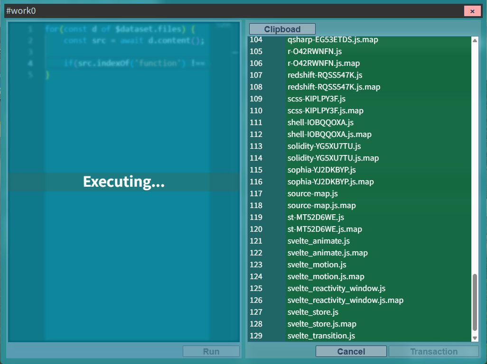
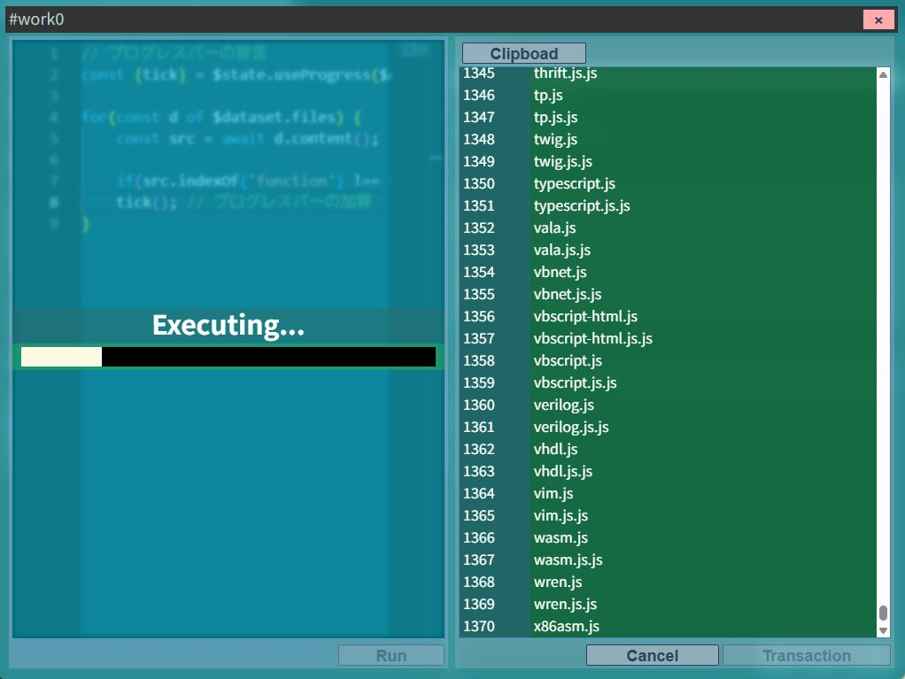
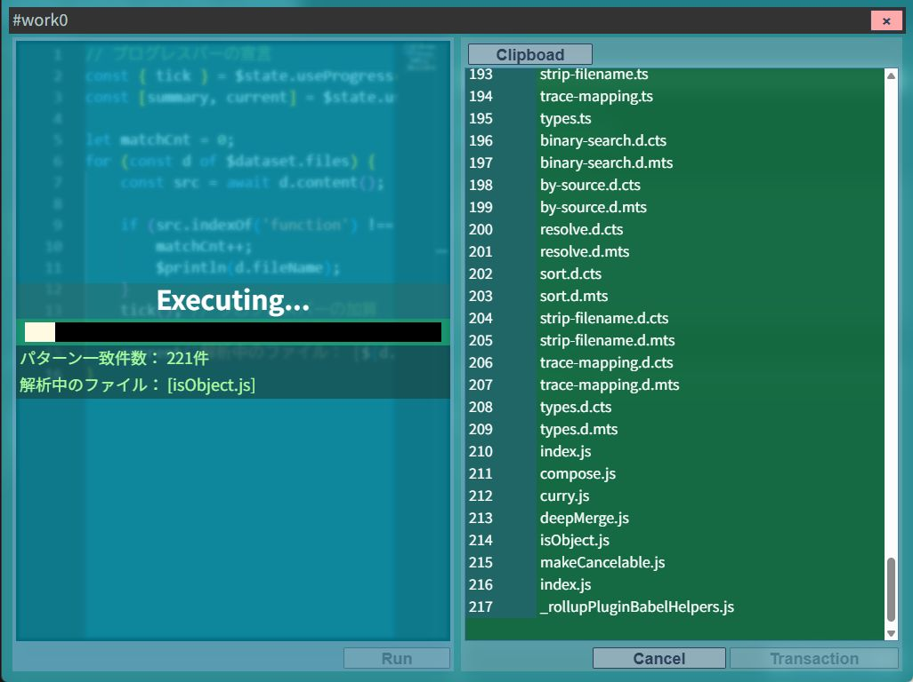

# $state API リファレンス

`$state` は、スクリプトの実行中にGUI上へ**プログレスバー**や**モニター**を表示するためのAPIです。

処理の進捗状況や現在の状態をリアルタイムで確認できます。



---

## プログレスバー — `useProgress`

### 用途

大量のファイルを処理するなど、完了まで時間がかかる処理で**進捗を可視化**します。

### 使い方

```typescript
const { tick } = $state.useProgress(totalCount);
```

`useProgress(totalCount)` で、指定した母数のプログレスバーをGUIに表示することを宣言し、操作ハンドルを返します。

**引数：**

| 引数 | 型 | 説明 |
|------|----|------|
| `totalCount` | `number` | プログレスバーの総数（母数） |

**返り値のプロパティ：**

| プロパティ | 型 | 説明 |
|-----------|-----|------|
| `tick` | `() => void` | プログレスバーを1つ進める関数 |

### コード例



```typescript
const { tick } = $state.useProgress($dataset.files.length);

for (const d of $dataset.files) {
  const content = await d.content();
  // ...処理...
  tick(); // 1ファイル処理するごとにプログレスを進める
}
```

---

## モニター — `useMonitor`

### 用途

処理中に変化する値（件数・ファイル名など）を、GUI上に**固定テキストとしてリアルタイム更新**して表示します。

### 使い方

```typescript
const [update1, update2] = $state.useMonitor(2);
```

`useMonitor(count)` で、指定した数だけのモニタースロットを確保し、各スロットを更新する関数を配列で返します。

**引数：**

| 引数 | 型 | 説明 |
|------|----|------|
| `count` | `number` | 確保するモニタースロットの数 |

**返り値：**

`((text: string) => void)[]` — スロット数と同じ長さの更新関数の配列

### コード例



```typescript
const [summary, current] = $state.useMonitor(2);

let matchCnt = 0;
for (const d of $dataset.files) {
  current(`解析中のファイル: [${d.fileName}]`);   // 現在処理中のファイルを表示
  const content = await d.content();
  if (content.includes('TARGET')) {
    matchCnt++;
  }
  summary(`パターン一致件数: ${matchCnt}件`);       // 一致件数をリアルタイム更新
}
```

---

## プログレスバーとモニターの組み合わせ

`useProgress` と `useMonitor` は**同時に使用可能**です。

```typescript
const { tick } = $state.useProgress($dataset.files.length);
const [summary, current] = $state.useMonitor(2);

let matchCnt = 0;

for (const d of $dataset.files) {
  current(`解析中: [${d.fileName}]`);
  const content = await d.content();
  if (content.includes('TARGET')) {
    matchCnt++;
    summary(`一致件数: ${matchCnt}件`);
  }
  tick();
}
```

実行中のGUIには以下が同時に表示されます：

- プログレスバー（全体の進捗）
- `current` テキスト（現在処理中のファイル名）
- `summary` テキスト（累積一致件数）
